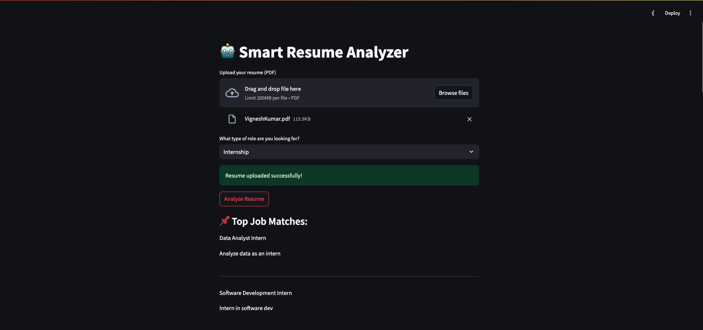
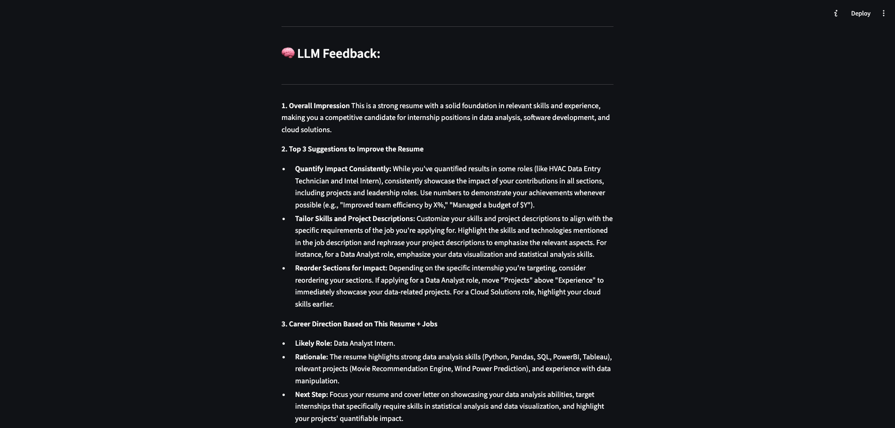
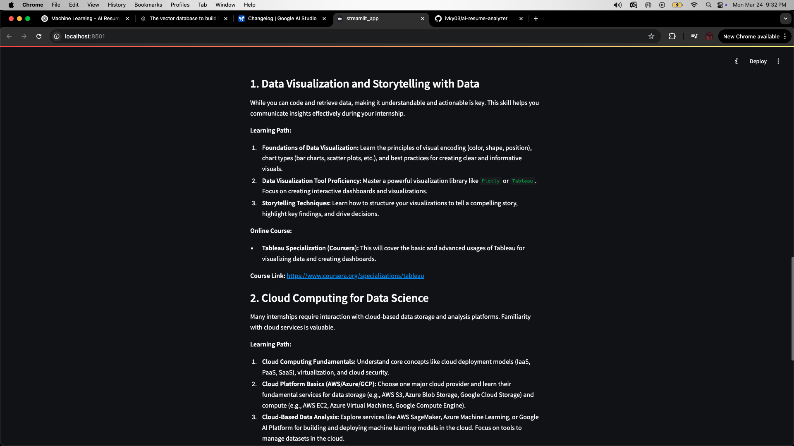
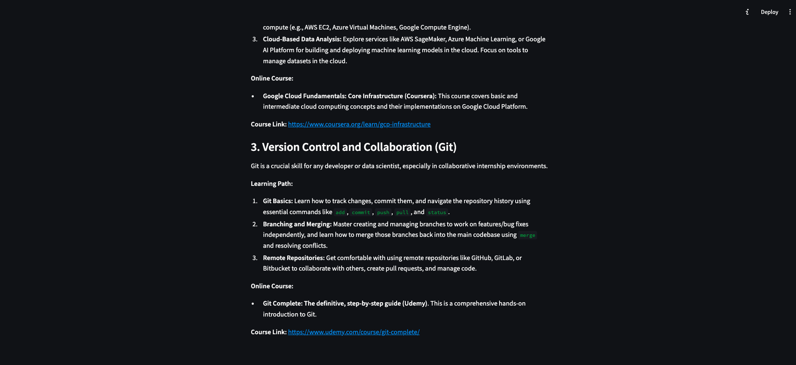

# 🤖 ResumeGPT: Smart Job Matcher + Skill Gap Coach

An end-to-end AI-powered tool that analyzes resumes, matches them with relevant job roles, and recommends personalized learning paths using Google Gemini.

### 🔍 Features

- 📄 Resume PDF parsing
- 🔎 Job matching using embeddings (RAG)
- 🧠 Gemini LLM feedback (on resume quality & career direction)
- 📘 Personalized skill gap learning plans with course recommendations
- ☁️ Streamlit frontend + FastAPI backend

### 🚀 Live Demo

👉 [Try it on Streamlit Cloud](https://resumegpt-job-matcher-skill-gap-coach.streamlit.app/)

---

### 🛠️ Tech Stack

- Python
- Streamlit (Frontend)
- FastAPI (Backend)
- Google Gemini API
- SentenceTransformers (Embeddings)
- Numpy, Pandas
- PyMuPDF (PDF parsing)

### ✨ Sample Output

